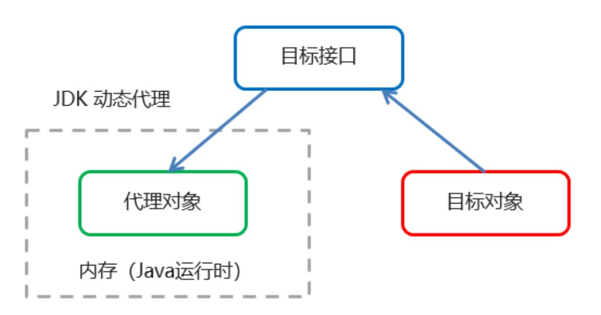
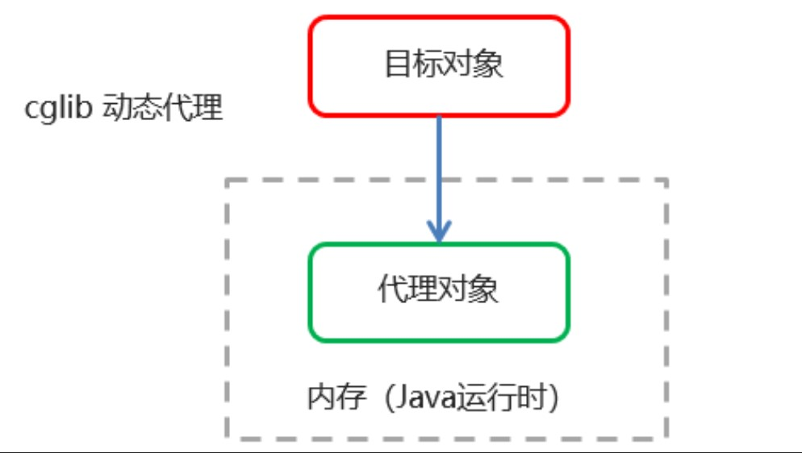

# spring-demo
my spring demo

## 1. spring 体系结构


### 1.1 ApplicationContext

接口类型，代表应用上下文，可以通过其实例获得Spring容器中的Bean对象

#### 1.1.1 ApplicationContext 实现类

- ClassPathXmlApplicationContext

    它是从类的根路径下加载配置文件

- FileSystemXmlApplicationContext

    它是从磁盘路径上加载配置文件，配置文件可以在磁盘的任意位置

- AnnotationConfigApplicationContext

    当使用注解配置容器时，需要使用此类来创建 spring 容器，用来读取注解

#### 1.1.2 getBean() 方法使用

```java
public Object getBean(String name) throws BeanException {
    assertBeanFactoryActive();
    return getBeanFactory(),getBean(name);
}

public <T> T getBean(Class<T> requiredType) throws BeanException {
    assertBeanFactoryActive();
    return getBeanFactory().getBean(requiredType);
}
```

当参数类型是字符串时，表示根据Bean的id从容器中获得Bean是，返回的是Object，需要强转，当参数的数据类型是Class类型时，表示根据类型从容其中匹配Bean实例，当容器中相同类型的Bean有多个时，则此方法会报错。

## 2. spring IOC配置(XML)

### 2.1 基本配置

用于配置对象交由spring配置

默认情况下调用的是类中的无参构造函数，没有无参构造函数则不能创建成功

- 基本配置文件

    ```xml
    <?xml version="1.0" encoding="UTF-8"?>
    <beans xmlns="http://www.springframework.org/schema/beans"
           xmlns:xsi="http://www.w3.org/2001/XMLSchema-instance"
           xsi:schemaLocation=
                   "http://www.springframework.org/schema/beans 
                   http://www.springframework.org/schema/beans/spring-beans.xsd">
    
    </beans>
    ```

    

基本属性：

- id：bean实例在spring容器中的唯一标识

- class：Bean 的全限定名称

    ```xml
     <bean id="user" class="ioc.xml.pojo.User"/>
    ```


### 2.2 范围配置

配置bean时可以指定对象的作用范围（scope），取值如下

| 取值范围       | 说明                                                         |
| -------------- | ------------------------------------------------------------ |
| singleton      | 默认的，单例的                                               |
| prototype      | 多例的                                                       |
| request        | web项目中，Spring创建一个Bean对象，将对象存入request域中     |
| session        | web项目中，Spring创建一个Bean对象，将对象存入session域中     |
| global session | web项目中，应用在Portlet环境，如果没有Portlet环境那么global session相当于session |

### 2.3 生命周期方法

init-method：指定类中的初始化方法名称

destroy-method：指定类中的销毁方法名称

### 2.4 实例化方式

- 无参构造方法实例化

    它会根据默认无参构造方法创建对象，如果bean中没有默认无参构造方法，将会创建失败

    ```xml
     <bean id="user" class="ioc.xml.pojo.User"/>
    ```

    

- 工厂静态方法实例化

    UserStaticFactory.java

    ```java
    package ioc.xml.instantiation;
    
    import ioc.xml.pojo.User;
    
    public class UserStaticFactory {
        public static User createUser() {
            return  new User("static factory instantitation");
        }
    }
    
    
    ```

    配置文件

    ```xml
    <bean id="user4StaticFactory" class="ioc.xml.instantiation.UserStaticFactory" factory-method="createUser"/>
    ```

- 工厂实例方法实例化

    UserDynamicFactory.java

    ```java
    package ioc.xml.instantiation;
    
    import ioc.xml.pojo.User;
    
    public class UserDynamicFactory {
        public User createUser() {
            return new User("dynamic factory method instantiation");
        }
    }
    ```
    
    

    配置文件

    ```xml
<bean id="userDynamicFactory" class="instantiation.UserDynamicFactory"/>
    
    <bean id="user4DynamicFactory" factory-bean="userDynamicFactory" factory-method="createUser"/>
    
    ```

### 2.5 依赖注入（Dependency injection）

依赖注入时spring框架核心IOC的具体实现。在编写程序时，通过控制反转，把对象的创建交给了spring，但是代码中不可能出翔没有依赖的情况。IOC解耦只能降低依赖关系，但不会消融，业务层仍然会调用持久层的方法，业务层与持久层的依赖关系交由spring维护。

- 方式

    User.java

    ```java
    package ioc.xml.pojo;
    
    public class User {
        private String createMethod;
        private String name;
        private Integer age;
    
        public User(String name, Integer age,String createMethod) {
            this.name = name;
            this.age = age;
            this.createMethod = createMethod;
        }
    
        public User() {
            this.createMethod = "No Arguments instantiation";
        }
    
        public User(String method) {
            this.createMethod = method;
        }
    
        public String getName() {
            return name;
        }
    
        public void setName(String name) {
            this.name = name;
        }
    
        public String getCreateMethod() {
            return createMethod;
        }
    
        public void setCreateMethod(String createMethod) {
            this.createMethod = createMethod;
        }
    
        public Integer getAge() {
            return age;
        }
    
        public void setAge(Integer age) {
            this.age = age;
        }
    
        @Override
        public String toString() {
            return "User{" +
                    "createMethod='" + createMethod + '\'' +
                    ", name='" + name + '\'' +
                    ", age=" + age +
                    '}';
        }
    }
    
    
    
    ```

    - 构造方法注入

        配置文件

        ```xml
        <bean id="user4Constructor" class="ioc.xml.pojo.User">
            <constructor-arg name="name" value="name"/>
            <constructor-arg name="age" value="22"/>
            <constructor-arg name="createMethod" value="constructor DI"/>
        </bean>
        ```

        

    - set方法

        配置文件

        ```xml
        <bean id="user4Set" class="pojo.User">
            <property name="name" value="name"/>
            <property name="age" value="22"/>
            <property name="createMethod" value="set DI"/>
        </bean>
        ```
        
        p 命名空间注入
        
        p命名空间注入本质也是set方法注入，但比较上述的set方法注入更加方便。
        
        引入命名空间
        
        ```xml
        <bean id="user4p" class="pojo.User" p:name="name" p:age="22" p:createMethod="tag p DI" />
        ```
    ```
    
    ```

- 不同数据类型的注入

    在 Spring 中还可以对基本数据类型、集合等都可以在容器中进行注入

    - 基础数据类型注入

        BasicDI.java

        ```java
        package dao.impl;
        
        
        public class BasicDI {
            private String username;
            private Integer age;
        
            public void setUsername(String username) {
                this.username = username;
            }
        
            public void setAge(Integer age) {
                this.age = age;
            }
        }
        
        ```

        

        配置文件

        ```xml
        <bean id="userDao2" class="dao.impl.BasicDI">
            <property name="username" value="zhangsan"/>
            <property name="age" value="12"/>
        </bean>
        ```

    - 集合数据类型(List)注入

        ListDI.java

        ```java
        package dao.impl;
        
        import java.util.List;
        
        public class ListDI {
            private List<String> strList;
        
            public void setStrList(List<String> strList) {
                this.strList = strList;
            }
        }
        
        ```

        配置文件

        ```xml
        <bean id="listDI" class="dao.impl.ListDI">
            <property name="strList">
                <list>
                    <value>abc</value>
                    <value>def</value>
                    <value>ghi</value>
                </list>
            </property>
        </bean>
        ```

    - 集合数据类型 （Map<String, User>）注入

        MapDI.java

        ```java
        package dao.impl;
        
        import pojo.User;
        
        import java.util.Map;
        
        public class MapDI {
            private Map<String, User> userMap;
        
            public void setUserMap(Map<String, User> userMap) {
                this.userMap = userMap;
            }
        }
        
        ```

        配置文件

        ```xml
        <bean id="u1" class="pojo.User"/>
        <bean id="u2" class="pojo.User"/>
        <bean id="mapDI" class="dao.impl.MapDI">
            <property name="userMap">
                <map>
                    <entry key="user1" value-ref="u1"/>
                    <entry key="user2" value-ref="u2"/>
        
                </map>
            </property>
        </bean>
        ```

    - 集合数据类型 （Properties）的注入

        PropertiesDI.java

        ```java
        package dao.impl;
        
        import java.util.Properties;
        
        public class PropertiesDI {
            private Properties properties;
        
            public void setProperties(Properties properties) {
                this.properties = properties;
            }
        }
        
        ```

        

        配置文件

        ```xml
        <bean id="propertiesDI" class="dao.impl.PropertiesDI">
            <property name="properties">
                <props>
                    <prop key="p1">value1</prop>
                    <prop key="p2">value2</prop>
                    <prop key="p3">value3</prop>
                </props>
            </property>
        </bean>
        ```

### 2.6 引入其他配置文件

```xml
<import resource="applicationContext-xxx.xml"/>
```


### 2.7 配置数据源

- 导入依赖

    - c3p0和druid坐标

        ```xml
        <!--    c3p0 坐标    -->
        <dependency>
            <groupId>c3p0</groupId>
            <artifactId>c3p0</artifactId>
            <version>0.9.1.2</version>
        </dependency>
        <!--    druid 坐标    -->
        <dependency>
            <groupId>com.alibaba</groupId>
            <artifactId>druid</artifactId>
            <version>1.1.10</version>
        </dependency>
        ```

        

    - mysql数据库驱动坐标

        ```xml
        
        <!--  mysql 驱动  -->
        <dependency>
            <groupId>mysql</groupId>
            <artifactId>mysql-connector-java</artifactId>
            <version>5.1.39</version>
        </dependency>
        ```

        

- 创建`jdbc.properties`文件

    ```properties
    jdbc.driver=com.mysql.jdbc.Driver
    jdbc.url=jdbc:mysql://localhost:3306/test
    jdbc.username=root
    jdbc.password=root
    ```

- `Spring`配置文件引入`jdbc.properties`

    - 引入context命名空间

        xmlns:context = "http://www.springframework.org/schema/context"

    - 引入约束路径

        http://www.springframework.org/schema/schema

        http://www.springframework.org/schema/context/spring-context.xsd

    - 引入配置文件

        ```xml
        <context:property-placeholer location="classpath:jdbc.peoprerties"/>
        <bean id="dataSource" class="com.mchange.v2.c3p0.ComboPooledDataSource">
        	<property name="driverClass" value="${jdbc.driver}"/>
            <property name="jdbcUrl" value="${jdbc.url}"/>
            <property name="user" value="${jdbc.username}"/>
            <property name="password" value="${jdbc.password}"/>
        </bean>
        ```


## 3. Spring IOC注解配置

### 3.1 Spring 的原始注解

在使用注解开发时需要在配置文件中配置注解扫描， 作用是指定哪个包及其子包下的Bean需要进行扫描以便识别使用注解配置的类，字段和方法

```xml
<context:component-scan base-package="annotation"/>
```

spring是轻代码而重配置的框架，配置比较繁重，影响开发效率，注解代替xml配置文件可以简化配置，提高开发效率

| 注解           | 说明                                            |
| -------------- | ----------------------------------------------- |
| @component     | 使用在类上用于实例化Bean                        |
| @Controller    | 使用在web层类上用于实例化Bean                   |
| @Service       | 使用在service层类上用于实例化Bean               |
| @Repository    | 使用在dao层类上用于实例化Bean                   |
| @Autowired     | 使用在字段上用于根据类型依赖注入                |
| @Qualifier     | 结合@Autowired一起使用用于根据名称进行依赖注入  |
| @Resource      | 相当于@Autowired + @Qualifier，按照名称进行注入 |
| @Value         | 注入普通属性                                    |
| @Scope         | 标注Bean的作用范围                              |
| @PostConstruct | 使用在方法上标注该方法Bean的初始化方法          |
| @PreConstruct  | 使用在方法上标注该方法是Bean的销毁方法          |

@component/@Repository 注解

```java
package ioc.annotation.dao.impl;

import ioc.annotation.dao.UserDao;
import org.springframework.stereotype.Repository;

//@Component("userDao")
@Repository("userDao")
public class UserDaoImpl implements UserDao {
    @Override
    public void save() {
        System.out.println("saving ............");
    }
}
```

@Component / @Service

@AutoWired / @Autowired @Qualifier / @Resource

@Scope

@Value

```java
package ioc.annotation.service.impl;

import ioc.annotation.dao.UserDao;
import ioc.annotation.service.UserService;
import org.springframework.beans.factory.annotation.Value;
import org.springframework.context.annotation.Scope;
import org.springframework.stereotype.Service;

import javax.annotation.PostConstruct;
import javax.annotation.PreDestroy;
import javax.annotation.Resource;

// @Component("userService")
@Service("userService")
@Scope("singleton")
public class UserServiceImpl implements UserService {
    //@Autowired
    /**
     * @Autowired
     * @Qualifier("userDao")
     */
    @Resource(name = "userDao")
    private UserDao userDao;

    @Value("string")
    private String str;

    @Value("12")
    private int num;

    @Override
    public void save() {
        System.out.println(toString());
        userDao.save();
    }

    @Override
    public String toString() {
        return "UserServiceImpl{" +
                "userDao=" + userDao +
                ", str='" + str + '\'' +
                ", num=" + num +
                '}';
    }

    @PostConstruct
    public void init() {
        System.out.println("init .........");
    }

    @PreDestroy
    public void destroy() {
        System.out.println("destroy .........");
    }
}

```

### 3.2 Spring 新注解

旧注解还不能完全全部替代xml配置文件，还需要使用注解代替的配置如下

- 非自定义Bean的配置

- 加载properties文件的配置

- 组件扫描配置

- 引入其他文件

    | 注解            | 说明                                                         |
    | --------------- | ------------------------------------------------------------ |
    | @Configuration  | 用于指定当前类是一个Spring配置类，当创建容器时会从该类上加载注解 |
    | @ComponentScan  | 用于指定Spring在初始化容器时要扫描的包，作用和在Spring的xml配置文件中的<context:component-scan base-package="...">一致 |
    | @Bean           | 使用在方法上，标注将该方法的返回值存储到Spring容器中         |
    | @PropertySource | 用于加载.properties文件中的配置                              |
    | @Import         | 用于导入其它配置类                                           |

    SpringConfiguration.class

    ```java
    package ioc.annotation.config;
    
    import org.springframework.context.annotation.ComponentScan;
    import org.springframework.context.annotation.Configuration;
    import org.springframework.context.annotation.Import;
    
    @Configuration
    @ComponentScan("ioc.annotation")
    @Import({DataSourcConfiguration.class})
    public class SpringConfiguration {
    }
    
    ```

    DataSourceConfiguration.class

    ```java
    package ioc.annotation.config;
    
    import com.mchange.v2.c3p0.ComboPooledDataSource;
    import org.springframework.beans.factory.annotation.Value;
    import org.springframework.context.annotation.Bean;
    import org.springframework.context.annotation.Configuration;
    import org.springframework.context.annotation.PropertySource;
    
    import javax.sql.DataSource;
    import java.beans.PropertyVetoException;
    
    @Configuration
    @PropertySource("classpath:jdbc.properties")
    public class DataSourcConfiguration {
        @Value("${jdbc.driver}")
        private String driver;
    
        @Value("${jdbc.url}")
        private String url;
    
        @Value("${jdbc.username}")
        private String user;
    
        @Value("${jdbc.password}")
        private String password;
    
        @Bean(name = "dataSource")
        public DataSource dataSource() throws PropertyVetoException {
            ComboPooledDataSource dataSource = new ComboPooledDataSource();
            dataSource.setDriverClass(driver);
            dataSource.setJdbcUrl(url);
            dataSource.setUser(user);
            dataSource.setPassword(password);
            return dataSource;
        }
    }
    
    ```

###3.3 Spring 整合 junit （spring-junit）

在对 spring 进行测试时，每个测试案例都需要创建 ApplicationContext 上下文对象，比较麻烦，而让 spring-junit 负责创建 spring 容器， 只需将配置文件的名称告知，测试Bena就可以在测试类中进行注入

spring 集成 junit 步骤

- 导入 spring 集成 junit 坐标

    ```xml
    <!--   junit     -->
    <dependency>
        <groupId>junit</groupId>
        <artifactId>junit</artifactId>
        <version>4.12</version>
        <scope>test</scope>
    </dependency>
    
    <!--  集成spring junit 测试
          注：
              spring 5 及其 以上版本需要junit的版本必须是 4.12及以上
     -->
    <dependency>
        <groupId>org.springframework</groupId>
        <artifactId>spring-test</artifactId>
        <version>5.0.2.RELEASE</version>
    </dependency>
    ```

    

- @Runwith 注解替换原来的运行期

- @ContextConfiguration 指定配置文件或配置类

- @Autowired 注入需要测试的对象

- 创建测试方法进行测试

## 4. Spring AOP

### 4.1 AOP概念

AOP(Aspect Oriented Programming)：面向切面编程，是通过预编译方式和运行期动态代理实现程序功能的统一维护的一种技术

AOP是OOP的延续，是软件开发中的一个热点，也是Spring框架中的一个重要内容，是函数式编程的一种衍生范型，利用AOP可以对业务逻辑的各个部分进行隔离。从而使得业务逻辑各部分之间的耦合度降低。提高程序的可重用性，同时提高了开发的效率

### 4.2 AOP的作用及其优势

作用：在程序运行期间，在不修改源码的情况下对方法进行功能增强

优势：减少重复代码，提高开发效率，并且便于维护

### 4.3 AOP的底层实现

AOP的底层通过Spring提供的动态代理技术实现的，在运行期间，Spring通过动态代理技术动态的生成代理对象，代理对象方法执行时进行增强功能的介入，再去调用目标对象的方法，从而完成功能的增强。

#### 4.3.1 AOP 的动态代理技术

- jdk 代理：基于接口的动态代理技术

    

    - 创建目标接口

        ```java
        package dynamic.proxy.jdk;
        
        /**
         * @author zhaihs
         * jdk 动态代理接口
         */
        public interface TargetInterface {
            /**
             * jdk 动态代理的目标方法
             */
            void targetMethod();
        }
        
        ```

        

    - 创建目标类

        ```java
        package dynamic.proxy.jdk;
        
        /**
         * @author zhaihs
         */
        public class Target implements TargetInterface {
            @Override
            public void targetMethod() {
                System.out.println("target method running ......");
            }
        }
        
        ```

        

    - 动态代理代码并测试

        代码：

        ```java
        package dynamic.proxy.jdk;
        
        import java.lang.reflect.InvocationHandler;
        import java.lang.reflect.Method;
        import java.lang.reflect.Proxy;
        
        /**
         * @author zhaihs
         * @date 2019/11/5
         */
        public class DynamicProxy {
        
            /**
             * 增强的目标方法名
             */
            private static String targetMethodName = "targetMethod";
        
            /**
             * 创建目标对象
             */
            private static Target target = new Target();
        
            public static void proxy() {
        
                // 获取代理对象
                TargetInterface proxy = (TargetInterface) Proxy.newProxyInstance(target.getClass().getClassLoader(), target.getClass().getInterfaces(), new InvocationHandler() {
                    @Override
                    public Object invoke(Object proxy, Method method, Object[] args) throws Throwable {
                        // 判断是否为目标方法
                        if (targetMethodName.equals(method.getName())) {
                            // 前置增强
                            System.out.println("before enhance");
                            // 目标方法执行
                            Object invoke = method.invoke(target, args);
                            // 后置增强
                            System.out.println("after enhance");
                            // 返回结果
                            return invoke;
                        }
                        // 非需增强的目标方法，直接执行
                        return method.invoke(target, args);
                    }
                });
        
                // 执行代理对象的增强方法
                proxy.targetMethod();
            }
        
            /**
             * main 方法测试
             */
            public static void main(String[] args) {
                proxy();
            }
        }
        ```

        执行结果

        ```
        before enhance
        target method running ......
        after enhance
        ```

    - 案例：敏感词过滤

        接口 类

        ```java
        package dynamic.proxy.jdk.demo;
        
        import java.util.List;
        
        /**
         * @author zhaihs
         * @date 2019/11/5
         */
        public interface PrintWords {
            /**
             * 打印 list 集合中的 字符串
             *
             * @param strList
             */
            void print(List<String> strList);
        }
        
        ```

        目标类

        ```java
        package dynamic.proxy.jdk.demo;
        
        import java.util.List;
        
        /**
         * @author zhaihs
         * @date 2019/11/5
         */
        public class Words implements PrintWords {
        
            @Override
            public void print(List<String> strList) {
                System.out.println(strList);
            }
        }
        
        ```

        代理类及其测试

        ```java
        package dynamic.proxy.jdk.demo;
        
        import com.sun.deploy.util.StringUtils;
        
        import java.lang.reflect.InvocationHandler;
        import java.lang.reflect.Method;
        import java.lang.reflect.Proxy;
        import java.util.ArrayList;
        import java.util.List;
        
        /**
         * @author zhaihs
         * @date 2019/11/5
         */
        public class WordFilter {
            private static String targetMethodName = "print";
            private static final String SENSITIVE_WORDS = "sb";
        
            static Words words = new Words();
            static PrintWords proxyInstance = (PrintWords) Proxy.newProxyInstance(words.getClass().getClassLoader(), words.getClass().getInterfaces(), new InvocationHandler() {
                @Override
                public Object invoke(Object proxy, Method method, Object[] args) throws Throwable {
                    if (targetMethodName.equals(method.getName())) {
                        List<String> strList = (List<String>) args[0];
        
                        for (int i = 0; i < strList.size(); i++) {
                            String str = strList.get(i);
                            if (str.contains(SENSITIVE_WORDS)) {
                                str = str.replaceAll(SENSITIVE_WORDS, new String(new char[SENSITIVE_WORDS.length()]).replace("\0", "*"));
                                strList.set(i, str);
                            }
                        }
        
                        return method.invoke(words, strList);
                    }
                    return method.invoke(words, args);
                }
            });
        
            public static void main(String[] args) {
                ArrayList<String> strings = new ArrayList<String>(3);
                strings.add("zz sb");
                strings.add("sb zz");
                strings.add("zz");
                System.out.println(strings);
                proxyInstance.print(strings);
            }
        }
        
        ```

        

- cglib代理：基于父类的动态代理技术

    

    - 目标类

        ```java
        package dynamic.proxy.cglib;
        
        /**
         * @author zhaihs
         * @date 2019/11/5
         */
        public class Target {
            public void method() {
                System.out.println("target running .........");
            }
        }
        
        ```

    - 代理方法

        ```java
        package dynamic.proxy.cglib;
        
        import org.springframework.cglib.proxy.Enhancer;
        import org.springframework.cglib.proxy.MethodInterceptor;
        import org.springframework.cglib.proxy.MethodProxy;
        
        import java.lang.reflect.Method;
        
        /**
         * @author zhaihs
         * @date 2019/11/5
         */
        public class TargetProxy {
            public static void main(final String[] args) {
                final Target target = new Target();
                Enhancer enhancer = new Enhancer();
                enhancer.setSuperclass(target.getClass());
                enhancer.setCallback(new MethodInterceptor() {
                    @Override
                    public Object intercept(Object o, Method method, Object[] objects, MethodProxy methodProxy) throws Throwable {
                        System.out.println("before enhance");
                        Object invoke = method.invoke(target, objects);
                        System.out.println("after enhance");
                        return invoke;
                    }
                });
                Target proxyTarget = (Target) enhancer.create();
                proxyTarget.method();
            }
        }
        
        ```

### 4.4 AOP相关概念

Spring 的 AOP实现底层就是对以上的动态代理进行了封装，封装后只需对关注的部分进行代码编写，并通过配置的方式完成指定目标的方法增强

- Target（目标对象）：代理目标对象
- Proxy（代理）：一个类被AOP织入增强后，就产生了一个结果代理类
- joinpoint（连接点）：可被拦截的点，在spring中点指的是方法，spring支支持方法类型的连接点
- Pointcut（切入点）：所谓切入点是拦截的点
- Advice（通知/增强）：所谓通知时至拦截到拦截点之后要执行的事情
- Aspect（切面）：切入点和通知的结合
- Weaving（织入）：是指把增强应用到目标对象来创建新的代理对象的过程，Spring采用的时动态代理织入，AspectJ采用的时编译期织入和类装载期织入。

### 4.5 Spring AOP开发

#### 4.5.1 XML配置开发

- 导入坐标

    ```xml
    <!--    spring Aop 坐标    -->
    <dependency>
        <groupId>org.springframework</groupId>
        <artifactId>spring-aop</artifactId>
        <version>5.0.5.RELEASE</version>
    </dependency>
    
    <!--    AspectJ织入    -->
    <dependency>
        <groupId>org.aspectj</groupId>
        <artifactId>aspectjweaver</artifactId>
        <version>1.8.13</version>
    </dependency>
    ```

- 织入配置

    ```xml
    <aop:config>
    	<aop:aspect ref="切面类">
        	<aop:before method="通过方法名称" pointcut="切点表达式"></aop:before>
        </aop:aspect>
    </aop:config>
    ```

    

- 切点表达式写法

    语法

    ````
    execution([修饰符] 返回值类型 包名.类名.方法名(参数))
    ````

    - 访问修饰符可以省略
    - 返回值类型、包名、类名、方法名可以使用 `*` 代表任意
    - 包名与类名之间一个点，代表当前包下的类，两个点表示当前包及其子包下的类
    - 参数列表可以使用两个点，表示任意个数、任意类型的参数列表

    例如：

    ```
    execution(public void com.site,aop.Target.method(..))
    execution(void com.site.aop.Target.*(..))
    execution(* com.site.aop.*.*(..))
    execution(* com.site.aop..*.*(..))
    execution(* *..*.*(..))
    ```

- 通知类型

    配置语法

    ```xml
    <aop:通知类型 method="切面类中方法名" pointcut="切点表达式"></aop:通知类型>
    ```

    | 名称         | 标签                    | 说明                                                   |
    | ------------ | ----------------------- | ------------------------------------------------------ |
    | 前置通知     | `<aop:before>`          | 用于配置前置通知，指定增强的方法在切入点方法之前执行   |
    | 后置通知     | `<aop:after-returning>` | 用于配置后置通知，指定增强的方法左切入点方法之后执行   |
    | 环绕通知     | `<aop:around>`          | 用于配置环绕通知，指定增强的方法在切入点之前和之后执行 |
    | 异常抛出通知 | `<aop:after-throwing>`  | 用于配置异常抛出通知，指定增强方法再出现异常时执行     |
    | 最终通知     | `<aop:after>`           | 用于配置最终通知，无论增强方式执行是否有异常都会执行   |

- 切点表达式的抽取

    多个增强的切点表达式相同时，可以将切点表达式进行抽取，在增强中使用`pointcut-ref`属性代替`pointcut`属性来引用抽取后的切点表达式

    ```xml
    <aop:config>
    	<!--  引用 myAspect 的 Bean 为切面对象  -->
        <aop:aspect ref="myAspect">
        	<aop:pointcut id="myPointcut" expression="execution(* com.site.aop.*.*(..))"/>
            <aop:before mehtod="before" pointcut-ref="myPointcut"></aop:before>
        </aop:aspect>
    </aop:config>
    ```

#### 4.5.2 注解开发

- 配置文件中配置 aop 自动代理

    `<aop:aspectj-autoproxy />`

- 注解通知的类型

    语法：`@通知注解("切点表达式")`

    | 名称         | 注解            |
    | ------------ | --------------- |
    | 前置通知     | @Before         |
    | 后置通知     | @AfterReturning |
    | 环绕通知     | @Around         |
    | 异常抛出通知 | @AfterThrowing  |
    | 最终通知     | @After          |

- 切点表达式抽取

    在切面中定义方法，在该方法上使用`@Pointcut`注解定义切点表达式，然后再增前注解中进行引用。

    ```java
    @Component("myAspect")
    @Aspect
    public class MyAspect{
        @Before("MyAspect.myPoint()")
        public void before(){
            System.out,println("enhance before code");
        }
        
        @Pointcut("execution(* com.site.aop.*.*(..))")
        public void myPoint(){}
    }
    ```

#### 4.5.3 环绕通知

环绕通知可以传递参数


```java
public Object around(ProceedingJoinPoint pjb) throws Throwable {
    System.out.println("enhance before method");
    Object proceed = pjb.proceed();    
    System.out.println("enhance after method");    
    return proceed;
}
```

## 5 声明式事务控制

### 5.1 声明式事务控制

Spring 的声明式事务就是采用声明的方式来处理事务。即在配置文件中声明，用在Spring配置文件中声明式的处理事务来代替代码式的处理事务。

优势：

- 事务管理不侵入开发的组件，具体来说，业务逻辑对象就不会意识到正在事务管理中，因为事务管理式属于系统层面的服务，而不是业务逻辑的一部分，如果想要改变事务管理策划的话，也只需要在自定义文件中重新配置即可
- 在不需要事务管理的时候，只需要在设定文件上修改，即可移去事务管理服务，无需改变代码重新编译，方便维护

> Spring 声明式事务控制底层就是AOP


### 5.1 编程式事务控制相关对象

- PlatformTransactionManager

    PlatformTransactionManager接口是spring的事务管理器，它里面提供了我们常用的操作事务的方法

    | 方法                                                         | 说明               |
    | ------------------------------------------------------------ | ------------------ |
    | TransactionStatus getTransaction(TransactionDefination defination) | 获取事务的状态信息 |
    | void commit(TranscationStatus status)                        | 提交事务           |
    | void rollback(TranscationStatus status)                      | 回滚事务           |

    PlatformTransactionManager 是接口类型，不同的Dao层技术则有不同的实现类，例如：

    当Dao层采用jdbc或mybatis时：org.springframework.jdbc.dataSource.DataSourceTransactionManager

    Dao层技术采用Hibernate时：org.springframwork.orm.HibernateTransactionManager

- TransactionDefinition

    事务定义的信息对象

    | 方法                         | 说明               |
    | ---------------------------- | ------------------ |
    | int getIsolationLevel()      | 获得事务的隔离等级 |
    | int getPropogationBehavior() | 获得事务的传播行为 |
    | int getTimeout()             | 获得超时时间       |
    | boolean isReadOnly()         | 是否只读           |

    1. 事务隔离级别
        - ISOLATION_DEFAULT
        - ISOLATION_READ_UNCOMMITTED
        - ISOLATION_READ_COMMITTED
        - ISOLATION_REPEATABLE_READ
        - ISOLATION_SERIALIZABLE
    2. 事务传播级别
        - REQUIRED：如果当前没有事务，就新建一个事务，如果已存在一个事务中，加入到这个事务中（默认值）
        - SUPPORTS：支持当前事务，如果当前没有事务，就以非事务方式执行
        - MANDATORY：使用当前事务，如果当前没有事务，就抛出异常
        - REQUERS_NEW：新建事务，如果当前在事务中，把当前事务挂起
        - NOT_SUPPORTED：以非事务方式执行操作，如果当前存在事务，就把当前事务观其
        - NEVER：以非事务方式运行，如果当前存在事务，抛出异常
        - NESTED：如果当前存在事务，则在嵌套事务内执行，如果当前没有事务，则执行REQUIRED类似的操作
        - 超时时间：默认是-1，没有超时限制，如果有，以秒为单位进行设置
        - 是否只读：建议查询设置为只读

- TransactionStatus

    事务具体的运行状态

    | 方法                       | 说明           |
    | -------------------------- | -------------- |
    | boolean hasSavepoint()     | 是否存储回滚点 |
    | boolean isCompleted()      | 事务是否完成   |
    | boolean isNewTransaction() | 是否是新事物   |
    | boolean isRollbackOnly()   | 事务是否回滚   |

### 5.2 声明式事务控制实现

1. XML

    - 引入`tx`命名空间

        ```xml
        <?xml version="1.0" encoding="UTF-8"?>
        <beans xmlns="http://www.springframework.org/schema/beans"
               xmlns:context="http://www.springframework.org/schema/context"
               xmlns:aop="http://www.springframework.org/schema/aop"
               xmlns:tx="http://www.springframework.org/schema/tx"
               xmlns:xsi="http://www.w3.org/2001/XMLSchema-instance"
               xsi:schemaLocation=
                       "http://www.springframework.org/schema/beans
                       http://www.springframework.org/schema/beans/spring-beans.xsd
                       http://www.springframework.org/schema/context
                       http://www.springframework.org/schema/context/spring-context.xsd
                       http://www.springframework.org/schema/aop
                       http://www.springframework.org/schema/aop/spring-aop.xsd
                       http://www.springframework.org/schema/tx
                       http://www.springframework.org/schema/tx/spring-tx.xsd">
        
        </beans>
        ```

        

    - 配置事务增强 

        ```xml
        <!--  配置平台事务管理  -->
        <bean id="transactionManager" class="org.springframework.jdbc.datasource.DataSourceTransactionManager">
            <property name="dataSource" ref="dataSource"/>
        </bean>
        
        <!--  事务管理器  -->
        <tx:advice id="txAdvice" transaction-manager="transactionManager">
            <tx:attributes>
                <tx:method name="*"/>
            </tx:attributes>
        </tx:advice>
        ```

        - `<tx:method>`代表切点方法的事务参数的配置

            ```xml
            <tx:method name="transfer" isolation="REPEATABLE_READ" propagation="REQUIRED" timeout="-1" read-only="false"/>
            ```

            1. name：切点方法名称
            2. isolation：事物的隔离级别
            3. propagation：事物的传播行为
            4. timeout：超时时间
            5. read-only：是否只读

2. 注解配置声明式事务控制解析

    - 使用 `@Transactional`在需要进行事务控制的类或是方法上修饰，注解可用的属性同于xml 配置方式
    - 注解使用在类上，那么该类下的所有方法都使用同一套注解参数配置
    - 使用在方法上，不同的方法可以采用不同的事务参数配置
    - XML配置文件中要开启事务的注解驱动`<tx:annotation-driven/>`